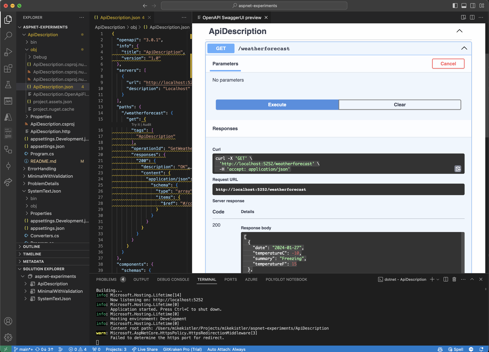

# ApiDescription

This project is a simple example of how to use the `ApiDescription` package to generate
an OpenAPI description for your API.

## How I built it

Start with a new web api project.

```bash
dotnet new webapi -o ApiDescription
dotnet sln add ApiDescription/ApiDescription.csproj
```

Personal preference: convert line endings to LF.

```bash
cd ApiDescription
find . -type f | grep -v 'obj/' | grep -v 'bin/' | grep -v .git | while read f; do sed -i '' 's/\r//' $f; done
```

Add the [`ApiDescription.Server`] package.

```bash
dotnet add package Microsoft.Extensions.ApiDescription.Server --version 8.0.1
```

and enable it in the project file.

```xml
  <PropertyGroup>
    <OpenApiGenerateDocumentsOnBuild>true</OpenApiGenerateDocumentsOnBuild>
  </PropertyGroup>
```

With these changes, `dotnet build` will generate an OpenAPI v3 description
for the service in `obj/API/ApiDescription.json`.

## Viewing the generated OpenAPI description in VSCode

Now that we are generating the OpenAPI description, we can use the [OpenAPI (Swagger) Editor] VSCode extension
to view SwaggerUI or ReDoc documentation based on this description.

But to get the "Try it out" functionality, we need to add the `servers` section to the OpenAPI description
and we need to add CORS support to the API.

### Adding the `servers` section

The easiest way to add the `servers` section is with the `AddServer` extension method of `SwaggerGenOptions`.

```csharp
builder.Services.AddSwaggerGen(options =>
{
    options.AddServer(new OpenApiServer { Url = "http://localhost:5252", Description = "Localhost" });
});
```

I hard-coded the port number, but it would be better to get it from the configuration.

### Adding CORS support

To add CORS support, we need to add the `CorsPolicy` to the service collection.

```csharp
builder.Services.AddCors(options =>
{
    options.AddDefaultPolicy(builder =>
    {
        builder.WithOrigins("vscode-webview://1f6ukv751kufrd8aitq58rbkqn8scflggesvhor0jlnh4gh96mac")
            .AllowAnyHeader()
            .AllowAnyMethod();
    });
});
```

The origin is the URI of the Swagger UI webview. I got this by running a local `nc` server and
capturing the request.

```text
>nc -l 5252
GET /weatherforecast HTTP/1.1
Host: localhost:5252
Connection: keep-alive
sec-ch-ua: "Not.A/Brand";v="8", "Chromium";v="114"
accept: application/json
sec-ch-ua-mobile: ?0
User-Agent: Mozilla/5.0 (Macintosh; Intel Mac OS X 10_15_7) AppleWebKit/537.36 (KHTML, like Gecko) Code/1.85.2 Chrome/114.0.5735.289 Electron/25.9.7 Safari/537.36
sec-ch-ua-platform: "macOS"
Origin: vscode-webview://1f6ukv751kufrd8aitq58rbkqn8scflggesvhor0jlnh4gh96mac
Sec-Fetch-Site: cross-site
Sec-Fetch-Mode: cors
Sec-Fetch-Dest: empty
Accept-Encoding: gzip, deflate, br
Accept-Language: en-US
```

with these changes in place, we can now run the API, view the documentation in the Swagger UI webview,
and use the "Try it out" functionality.



## A Better OpenAPI description

Now we are getting a "bare bones" OpenAPI description for the service, but we can do better.

We can use the [`Spectral linter`] to check the description for errors and warnings.

We need to install Spectral and create a basic `spectral.yaml` file.

```yaml
extends: spectral:oas
```

Here we use the standard [OpenAPI ruleset], which verifies compliance with the OpenAPI Specification
and some well-known best practices. We could add custom rules to this file,
or disable some of the standard rules, either globally or for specific paths or operations,
but for now we will use the standard rules.

Now we can run the linter.

```text
>spectral lint ApiDescription/obj/ApiDescription.json

/Users/mikekistler/Projects/mikekistler/aspnet-experiments/ApiDescription/obj/ApiDescription.json
  3:10  warning  info-contact           Info object must have "contact" object.                        info
  3:10  warning  info-description       Info "description" must be present and non-empty string.       info
 15:13  warning  operation-description  Operation "description" must be present and non-empty string.  paths./weatherforecast.get
 17:11  warning  operation-tag-defined  Operation tags must be defined in global tags.                 paths./weatherforecast.get.tags[0]

✖ 4 problems (0 errors, 4 warnings, 0 infos, 0 hints)
```

Note that we could also use the [`Spectral VSCode extension`] to see all of this issues right in VSCode.

The following sections describe how to fix these issues.

### Fixing the Info object

The first two warnings are about the `info` object. We can fix these by specifying an `OpenAPIInfo` object
on the `SwaggerDoc` extension method of `SwaggerGenOptions`.
See the [API Info and Description] documentation on MS Learn for more information.

### Fixing the tags

Spectral reports an `operation-tag-defined` warning for the `get` operation on `/weatherforecat`.
To fix this, we need to add a tag description in the top-level `tags` section of the OpenAPI description.
This can be done with a `DocumentFilter` as described in the
[SwashBuckle documentation](https://github.com/domaindrivendev/Swashbuckle.AspNetCore#document-filters).

While we are at it, we also want to change the tag for this operation -- SwashBuckle sets it to "ApiDescription"
by default, be we can change that to "Weather Forecast" with the `.WithTags` extension method on the route.

### Adding a description to the operation

In controller-based apps, you can use XML comments to add descriptions to the operations.
But in a Minimal API app like this one, we need to use the `.WithOpenApi` extension method on the route.
This approach is described in the [Add Summary and Description] topic of the Minimal API docs on MS Learn.

## References

- [`ApiDescription.Server`]
- [OpenAPI (Swagger) Editor]
- [Spectral linter]
- [OpenAPI ruleset]
- [Spectral VSCode extension]
- [API Info and Description]
- [Add Summary and Description]

<!-- Links -->

[`ApiDescription.Server`]: https://www.nuget.org/packages/Microsoft.Extensions.ApiDescription.Server
[OpenAPI (Swagger) Editor]: https://marketplace.visualstudio.com/items?itemName=42Crunch.vscode-openapi
[Spectral linter]: https://stoplight.io/open-source/spectral
[OpenAPI ruleset]: https://meta.stoplight.io/docs/spectral/4dec24461f3af-open-api-rules
[Spectral VSCode extension]: https://marketplace.visualstudio.com/items?itemName=stoplight.spectral
[API Info and Description]: https://learn.microsoft.com/en-us/aspnet/core/tutorials/getting-started-with-swashbuckle?view=aspnetcore-7.0&tabs=netcore-cli#api-info-and-description
[Add Summary and Description]: https://learn.microsoft.com/en-us/aspnet/core/fundamentals/minimal-apis/openapi?view=aspnetcore-7.0#add-endpoint-summary-or-description
